# 小市值策略回测分析报告

**策略名称**：纯小市值轮动策略  
**研究日期**：2026-04-20（宏观因子更新）  
**回测平台**：JoinQuant 聚宽  
**样本量**：57 组回测，覆盖 2013–2026 年多个市场环境

---

## 一、策略概述

本策略基于 A 股小市值效应，每个调仓周期买入市值最小的若干只股票，依靠小市值股票相对于大盘的系统性超额收益获利。核心逻辑不依赖任何基本面或技术面过滤，纯粹利用市值因子排序。

**核心参数（基准配置）：**

| 参数 | 值 | 说明 |
|------|------|------|
| `g.stocknum` | 3（增强版 30） | 持股数量 |
| `g.refresh_rate` | 5–8 | 调仓频率（交易日） |
| 市值区间 | 20–30 亿 | `between(20, 30)` |
| 调仓逻辑 | 买入区间内市值最小 N 只 | 每日日初执行 |
| 停牌过滤 | 是 | 过滤停牌和跌停股票 |

---

## 二、全期历史回测（2013–2026）

本策略长期有效性在 13 年全期回测中得到验证，策略收益显著超越沪深 300 基准（基准收益 68.45%）。

> **宏观利率环境**：1Y 基准/LPR 从 6.00%（2012）→ 3.00%（2026），SHIBOR 3M 年均从 4.67%（2013）→ 1.50%（2026Q1），整体处于 13 年降息大周期。策略最大回撤区间（2017/03–2018/10）恰逢去杠杆紧缩期，SHIBOR 3M 年均 4.49%（2017）。

### 2.1 增强版（30 股，周期 7）

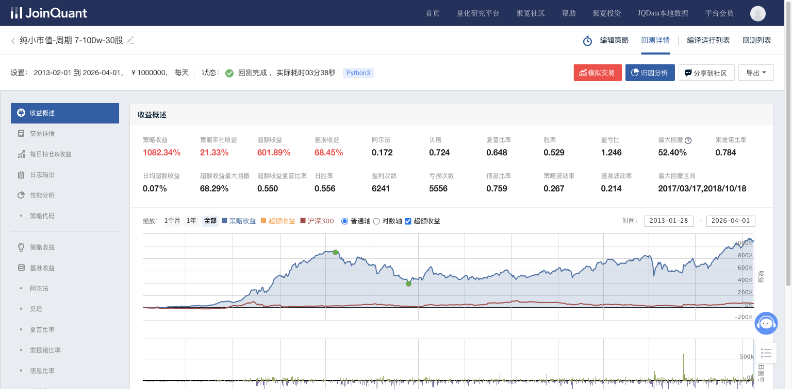

| 指标 | 数值 |
|------|------|
| 策略收益 | **1082.34%** |
| 年化收益 | 21.33% |
| 超额收益 | 601.89% |
| 基准收益 | 68.45% |
| Alpha | 0.172 |
| Beta | 0.724 |
| Sharpe 比率 | 0.648 |
| Sortino 比率 | 0.784 |
| 最大回撤 | 52.40% |
| 胜率 | 52.9% |
| 盈亏比 | 1.246 |
| **Calmar 比率** | **0.41** |
| 最大回撤区间 | 2017/03/17–2018/10/18 |

### 2.2 标准版（3 股，周期 7）

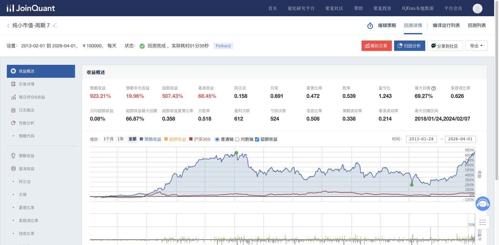

| 指标 | 数值 |
|------|------|
| 策略收益 | **923.21%** |
| 年化收益 | 19.96% |
| 超额收益 | 507.43% |
| Alpha | 0.158 |
| Sharpe 比率 | 0.472 |
| 最大回撤 | **69.27%** |
| **Calmar 比率** | **0.29** |
| 最大回撤区间 | 2018/01/24–2024/02/07 |

> **结论**：增强版（30 股）比标准版（3 股）大幅改善风险控制，最大回撤从 69.27% 降至 52.40%，Sharpe 从 0.472 升至 0.648，主要来自持股分散化效果。

---

## 三、调仓频率（refresh_rate）参数敏感性

回测区间：**2025-02-01 至 2026-03-31**（近期牛市行情），10 万元初始资金

> **宏观利率环境**：1Y LPR 3.10% → 3.00%（2025-05 降 10bp 后稳定至今），SHIBOR 3M 约 1.7% → 1.5%，处于历史极低位稳定期。周期 8 优于周期 7 的结果与「低位稳定期选 8 天」的 LPR 映射逻辑吻合（详见第八章 8.4）。

### 3.1 周期 8（最优）— 140.13%

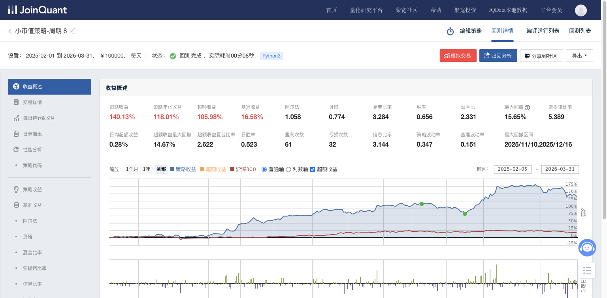

### 3.2 周期 7 — 122.65%

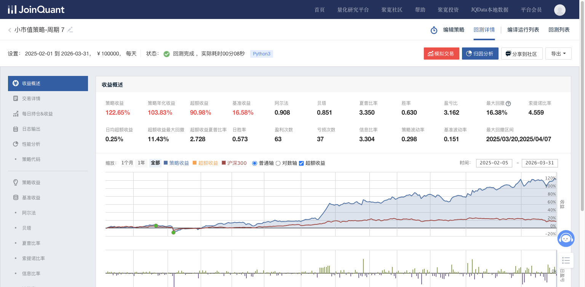

### 3.3 周期 9 — 89.04%

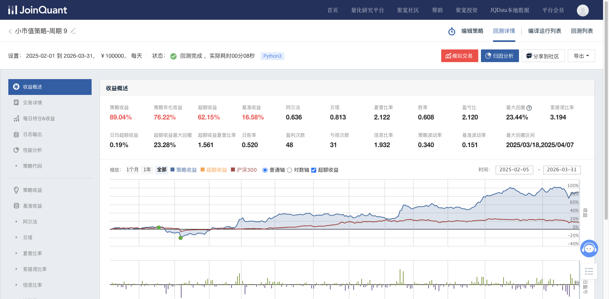

### 3.4 周期 10 — 66.29%

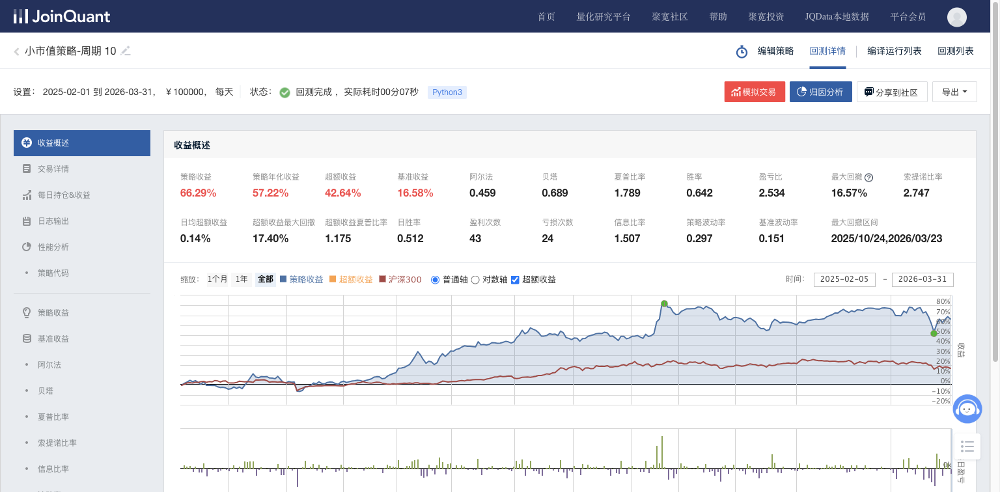

### 对比汇总（2025-02 至 2026-03）

| 调仓周期 | 策略收益 | 年化收益 | 最大回撤 | 胜率 | 盈亏比 | Sharpe | Calmar |
|---------|---------|---------|---------|------|-------|--------|--------|
| **7 天** | **122.65%** | 103.83% | 16.38% | 63.0% | **3.162** | **3.350** | 6.34 |
| **8 天** | **140.13%** | 118.01% | **15.65%** | **65.6%** | 2.331 | 3.284 | **7.54** |
| 9 天 | 89.04% | 76.22% | 23.44% | 60.8% | 2.120 | 2.122 | 3.25 |
| 10 天 | 66.29% | 57.22% | 16.57% | 64.2% | 2.534 | 1.789 | 3.45 |

> **胜率 vs 盈亏比**：各周期胜率在 60.8%–65.6% 之间，差异不大（~5%），说明调仓周期对胜率无显著影响。真正拉开收益差距的是**盈亏比**：周期 7 盈亏比 3.162（最高），意味着每赢一次赚的是亏一次的 3.16 倍；而周期 9 仅 2.120。短周期通过更频繁地兑现小市值溢价，提高了每笔盈利相对亏损的比值。**Calmar 比率**（年化收益/最大回撤）进一步验证：周期 8 的 Calmar 7.54 为最优，即每承受 1% 最大回撤可获得 7.54% 年化收益。

> **结论**：调仓频率 7–8 天最优。越小的周期反而有效，不适合长周期（10 天以上显著退化）。这符合小市值因子的短期均值回归特性——持有太久会吃掉后续反转溢价。

---

## 四、市值区间参数分析

回测区间：**2024-02-01 至 2025-03-31**（先跌后反弹的震荡偏牛市）

> **宏观利率环境**：1Y LPR 3.45% → 3.10%（期间 3 次降息共 -35bp，含 2024-10 史上最大单次 -25bp），SHIBOR 3M 从 ~2.2% 降至 ~1.7%，属于加速降息期。流动性持续释放支撑了 20-30 亿小市值区间 115.81% 的优异表现。

### 最优区间：20–30 亿

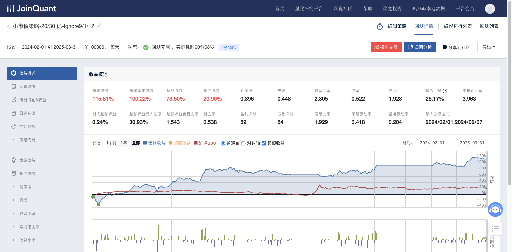

### 区间对比汇总

| 市值区间 | 策略收益 | 最大回撤 | Alpha | Sharpe | 备注 |
|---------|---------|---------|-------|--------|------|
| **20–30 亿** | **115.81%** | 28.17% | 0.896 | 2.305 | ✅ 最优 |
| 20–30 亿（无过滤） | 95.46% | 28.17% | — | — | 基准 |
| 30–40 亿 | -15.46% | 39.68% | — | — | 市值偏大，效应减弱 |
| 10–20 亿 | -41.38% | 68.65% | — | — | ❌ 流动性差 |
| 营收同比正增 | 60.41% | 25.98% | — | — | 基本面过滤反而减分 |

> **结论**：20–30 亿是 A 股小市值效应的"甜蜜区间"。10–20 亿流动性太差，遭遇系统性风险时无法有效出清；30 亿以上小市值溢价急速消退。

---

## 五、市场环境分析

### 5.1 震荡市（2023-02 至 2024-03）— 纯小市值周期7

> **宏观利率环境**：1Y LPR 3.65% → 3.45%（-20bp，2023-06 和 2023-08 两次降息），SHIBOR 3M 约 2.4%，处于缓慢降息期。利率仍在相对高位，流动性释放温和，策略收益 22.58% 尚可但回撤偏高（44.96%）。

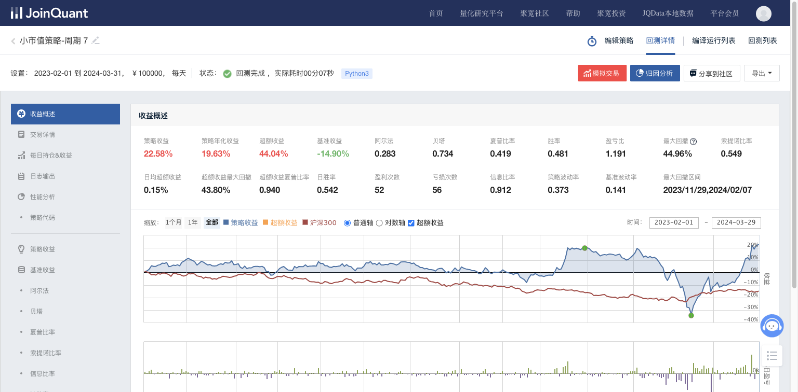

| 指标 | 数值 |
|------|------|
| 策略收益 | **22.58%** |
| 基准收益 | -14.90% |
| 超额收益 | 44.04% |
| Sharpe | 0.419 |
| 最大回撤 | 44.96% |

### 5.2 牛市（2025-02 至 2026-03）— 最高增益，最低回撤

> **宏观利率环境**：1Y LPR 3.10% → 3.00%，SHIBOR 3M ~1.7% → 1.5%，极低利率稳定期。充裕流动性叠加低波动环境，策略实现最高收益（140.13%）和最低回撤（15.65%）。

（见第三章 周期 8 截图，140.13%，MaxDD 15.65%）

### 环境对比汇总

| 市场环境 | 时段 | 收益 | 基准 | MaxDD | Calmar | 表现 |
|---------|------|------|------|-------|--------|------|
| 牛市 | 2025-02 to 2026-03 | 140.13% | 16.58% | 15.65% | **7.54** | ✅ 优 |
| 震荡市 | 2023-02 to 2024-03 | 22.58% | -14.90% | 44.96% | 0.44 | ✅ 中 |
| 其他参照 | 2020-02 to 2020-10 | 57.80% | 17.27% | 13.19% | — | ✅ 优 |
| 其他参照 | 2021-02 to 2022-03 | 34.36% | -21.10% | 11.76% | — | ✅ 优 |

> **关键发现**：纯小市值策略在温和上涨和震荡市最强。市场有方向就有超额收益；市场极端单边（纯牛/纯熊）时收益退化（超额被基准拖走）。

---

## 六、Bias 过滤器测试（失败案例）

回测区间：**2023-02-01 至 2024-03-31**（震荡市）

> **宏观利率环境**：同第 5.1 节，1Y LPR 3.65% → 3.45%，SHIBOR 3M ~2.4%，缓慢降息期。Bias 过滤在此利率环境下将策略从 +22.58% 拖至 -33.64%，说明利率温和下行期不宜叠加技术过滤。

### 无 Bias 过滤 vs 有 Bias 过滤

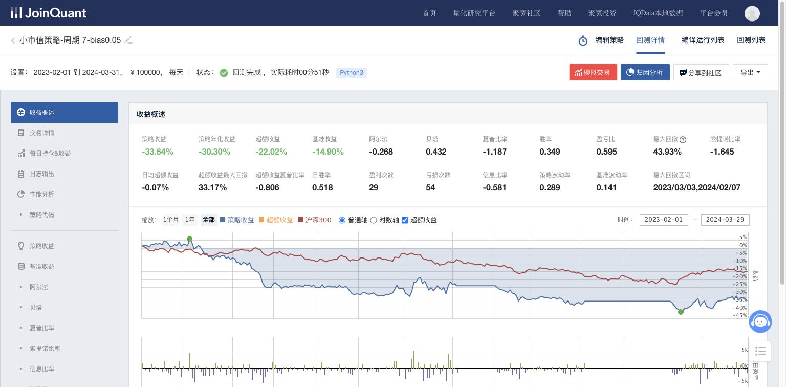

| 策略 | 时段 | 收益 | MaxDD | 说明 |
|------|------|------|-------|------|
| 纯小市值-周期7 | 2023 震荡市 | **+22.58%** | 44.96% | 无过滤 |
| 小市值-bias0.05 | 2023 震荡市 | **-33.64%** | 43.93% | 加 bias 过滤后 |
| 周期7-纯粹bias策略 | 2024 | -57.82% | 70.42% | 纯 bias 策略更差 |

> **结论**：Bias（乖离率）过滤器在震荡市中反而严重损害收益，将正收益变成大幅亏损。bias 过滤器会将市场回调时的"买入信号"错误地过滤掉，错失反弹机会。**不建议叠加 bias 过滤**。

---

## 七、背离策略专项分析

纯背离策略是基于均值回归信号（背离检测）的交易逻辑，**与弱趋势/震荡市相关性极高，且是放大效应**。

### 7.1 震荡市（最佳场景）— +75.72%

> **宏观利率环境**（2023-02 ~ 2024-03）：1Y LPR 3.65% → 3.45%，SHIBOR 3M ~2.4%。缓慢降息 + 震荡格局为背离策略的均值回归逻辑提供了理想土壤。

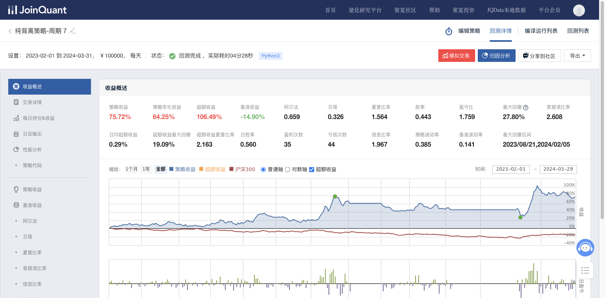

| 指标 | 数值 |
|------|------|
| 策略收益 | **75.72%** |
| 年化收益 | 64.25% |
| 超额收益 | 106.49% |
| Alpha | 0.659 |
| Sharpe | 1.564 |
| 最大回撤 | 27.80% |

### 7.2 牛市（最差场景）— -22.98%

> **宏观利率环境**（2025-04 ~ 2025-11）：1Y LPR 3.10% → 3.00%（2025-05 降 10bp），SHIBOR 3M ~1.7%，低利率宽松期。尽管流动性极度充裕，单边牛市中背离策略逆势做反转仍大幅亏损，说明流动性因子无法挽救方向性错误。

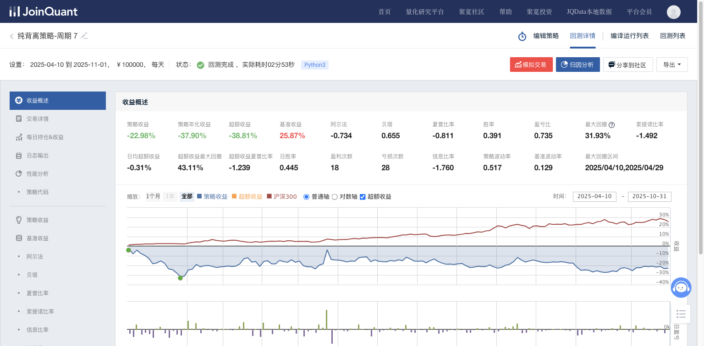

| 指标 | 数值 |
|------|------|
| 策略收益 | **-22.98%** |
| 年化收益 | -37.90% |
| Alpha | -0.734 |
| Sharpe | -0.811 |
| 最大回撤 | 31.93% |

### 7.3 背离策略市场环境汇总

| 市场环境 | 时段 | 收益 | MaxDD | Sharpe | 表现 |
|---------|------|------|-------|--------|------|
| 震荡市 | 2023-02 to 2024-03 | **+75.72%** | 27.80% | 1.564 | ✅ 强 |
| 震荡偏弱 | 2025-11 to 2026-04 | -7.81% | 20.90% | -0.669 | ⚠️ 中性偏差 |
| 牛市 | 2025-04 to 2025-11 | **-22.98%** | 31.93% | -0.811 | ❌ 极差 |
| 熊市 | 2022-07 to 2022-11 | -31.32% | 33.06% | -2.621 | ❌ 极差 |

> **核心结论**：背离策略只在震荡市中有效。牛市中市场持续单边上涨，背离信号全部失败（逆势做反转）；熊市中下跌趋势持续，背离买点被持续击穿。**纯牛市、纯熊市必死**。

---

## 八、宏观利率因子分析（LPR & SHIBOR 3M）

回测从 **2013 年**开始。LPR（贷款市场报价利率）新机制自 **2019 年 8 月 20 日**起执行（中国人民银行公告 [2019] 第15号），此前 A 股信贷定价使用人民银行基准贷款利率。SHIBOR（上海银行间同业拆放利率）3M 品种反映短期银行间流动性状况，每日报价，本报告取季末值。

### 8.1 LPR / 基准贷款利率历史数据

#### 2013–2019（人民银行基准贷款利率时期）

| 生效日期 | 1年期(%) | 5年期以上(%) | 备注 |
|---------|---------|------------|------|
| 2012-07-06 | 6.00 | 6.55 | 回测起始利率环境 |
| 2014-11-22 | 5.60 | 6.15 | 降息周期启动 |
| 2015-03-01 | 5.35 | 5.90 | |
| 2015-05-11 | 5.10 | 5.65 | |
| 2015-06-28 | 4.85 | 5.40 | |
| 2015-08-26 | 4.60 | 5.15 | |
| 2015-10-24 | **4.35** | **4.90** | 降息周期结束，此后近 4 年未变 |

> 数据来源：中国人民银行历次基准利率调整公告；东方财富 Choice 数据（https://data.eastmoney.com/cjsj/globalRateLPR.html ）

#### 2019-08 至 2026-04（LPR 新机制）

| 报价日期 | 1年期LPR(%) | 5年期以上LPR(%) | 变动(bp) | 备注 |
|---------|------------|---------------|---------|------|
| 2019-08-20 | 4.25 | 4.85 | — | LPR 新机制首次报价 |
| 2019-09-20 | 4.20 | 4.85 | 1Y -5 | |
| 2019-11-20 | 4.15 | 4.80 | 双降 5 | |
| 2020-02-20 | 4.05 | 4.75 | 双降 10/5 | COVID 宽松开启 |
| 2020-04-20 | 3.85 | 4.65 | 双降 20/10 | 大幅宽松 |
| 2021-12-20 | 3.80 | 4.65 | 1Y -5 | 19 个月未动后首降 |
| 2022-01-20 | 3.70 | 4.60 | 双降 10/5 | |
| 2022-05-20 | 3.70 | 4.45 | 5Y -15 | 5Y 单独大幅降 |
| 2022-08-22 | 3.65 | 4.30 | 双降 5/15 | |
| 2023-06-20 | 3.55 | 4.20 | 双降 10 | 10 个月未动后再降 |
| 2023-08-21 | 3.45 | 4.20 | 1Y -10 | |
| 2024-02-20 | 3.45 | 3.95 | 5Y -25 | 5Y 史上最大单次降幅 |
| 2024-07-22 | 3.35 | 3.85 | 双降 10 | |
| 2024-10-21 | 3.10 | 3.60 | **双降 25** | 力度最大一次 |
| 2025-05-20 | 3.00 | 3.50 | 双降 10 | |
| 2026-04-20 | 3.00 | 3.50 | 不变 | 已 11 个月未调整 |

> 数据来源：东方财富 LPR 品种数据（https://data.eastmoney.com/cjsj/globalRateLPR.html ），原始数据来自全国银行间同业拆借中心

### 8.2 SHIBOR 3M 季度数据

| 年份 | Q1 末(%) | Q2 末(%) | Q3 末(%) | Q4 末(%) | 年均约(%) | 流动性环境 |
|------|---------|---------|---------|---------|----------|----------|
| 2013 | 3.87 | 4.73 | 4.89 | 5.19 | 4.67 | 紧缩（钱荒） |
| 2014 | 5.56 | 5.07 | 4.60 | 4.69 | 4.98 | 高位回落 |
| 2015 | 4.86 | 3.28 | 3.08 | 3.08 | 3.58 | 快速宽松 |
| 2016 | 2.88 | 2.95 | 2.82 | 3.24 | 2.97 | 底部 |
| 2017 | 4.22 | 4.63 | 4.36 | 4.74 | 4.49 | 去杠杆紧缩 |
| 2018 | 4.73 | 4.29 | 2.95 | 3.18 | 3.79 | 下半年转松 |
| 2019 | 2.93 | 2.76 | 2.70 | 3.04 | 2.86 | 温和宽松 |
| 2020 | 2.09 | 1.45 | 2.64 | 3.03 | 2.30 | V 型（COVID） |
| 2021 | 2.77 | 2.45 | 2.39 | 2.51 | 2.53 | 稳定 |
| 2022 | 2.47 | 2.17 | 1.78 | 2.11 | 2.13 | 宽松 |
| 2023 | 2.52 | 2.36 | 2.10 | 2.51 | 2.37 | 小幅波动 |
| 2024 | 2.24 | 1.92 | 1.86 | 1.78 | 1.95 | 持续宽松 |
| 2025 | 1.69 | 1.70 | 1.68 | 1.55 | 1.66 | 历史低位 |
| 2026 Q1 | **1.50** | — | — | — | — | 新低 |

> 数据来源：东方财富 SHIBOR 数据（https://data.eastmoney.com/shibor/shibor/001,CNY,203.html ），原始数据来自全国银行间同业拆借中心。季末值取该季度最后一个交易日报价。

### 8.3 宏观利率 → 策略表现映射

将利率环境与回测结果交叉对照：

| 回测区间 | 1Y LPR/基准 | SHIBOR 3M | 策略收益 | MaxDD | Calmar | 利率环境 |
|---------|-----------|-----------|---------|-------|--------|----------|
| 2013–2026 全期 | 6.00→3.00 | 4.67→1.50 | +1082% | 52.4% | 0.41 | 长期降息大周期 |
| 2023-02~2024-03 震荡市 | 3.65→3.45 | ~2.4% | +22.58% | 44.96% | 0.44 | 缓慢降息 |
| 2024-02~2025-03 震荡偏牛 | 3.45→3.10 | 2.2→1.7% | +115.81% | 28.17% | 3.56 | 加速降息 |
| 2025-02~2026-03 牛市 | 3.10→3.00 | 1.7→1.5% | +140.13% | 15.65% | **7.54** | 低利率稳定期 |

### 8.4 LPR 因子与调仓周期（7 vs 8）的映射

| 利率状态 | SHIBOR 3M 参考 | 推荐 refresh_rate | 逻辑 |
|---------|---------------|-------------------|------|
| **LPR 下行期**（降息落地前后 1-3 月） | < 2.5% 且在下降 | **7 天** | 降息释放流动性脉冲，资金快速涌入小票，短周期捕捉动量效应 |
| **LPR 低位稳定期**（降息后 3 月+未再降） | < 2.0% 且稳定 | **8 天** | 流动性已充分释放，边际脉冲减弱，稍长持仓给小市值溢价更多兑现时间 |
| **LPR 上行 / 高位**（SHIBOR 收紧） | > 3.0% 或上升 | 谨慎 / 降仓位 | 流动性收紧直接压制小市值因子，2017 去杠杆期间最大回撤 52.4% |

**当前状态（2026-04-20）**：1Y LPR 3.00%，5Y+ LPR 3.50%，已 11 个月未调整；SHIBOR 3M 约 1.45%，处于历史极低位且持续下行。属于「低位稳定」阶段，**建议 refresh_rate = 8**。

> **核心逻辑**：LPR 代表信贷端定价，SHIBOR 3M 代表银行间短期流动性。降息落地时市场情绪亢奋，短周期轮动（7天）更能抓住脉冲行情；利率触底走平后，市场进入「低波动+高流动性」状态，稍长周期（8天）减少无效换手，让小市值溢价自然兑现。

---

## 九、综合结论与策略决策

### 9.1 核心发现

1. **小市值效应是真实且持续的**：全期年化 19–21%，超额收益 500%+，验证了 A 股小市值溢价的长期有效性。

2. **背离策略与弱趋势高度相关，且是放大效应，不能过于趋势**：在震荡市（2023）背离策略 75.72% vs 小市值 22.58%，放大效应明显；在牛市两者都反向放大失败（背离 -22.98%，小市值被基准拖累）。

3. **纯牛市纯熊市，必死**：
   - 纯牛市：基准高速上涨，小市值溢价被稀释；背离策略逆势操作损失惨重
   - 纯熊市：背离策略持续逆势抄底，被趋势击穿

4. **`g.refresh_rate` 参数 7、8 可能比较好；越小反而有效，不适合长周期**：
   - 周期 7: Sharpe 3.350（最高），收益 122.65%
   - 周期 8: 收益 140.13%（最高），Sharpe 3.284
   - 周期 10: 收益仅 66.29%，退化明显
   
5. **市值区间 20–30 亿是最优区间**：10 亿以下流动性危机，30 亿以上溢价消退。

6. **不建议叠加技术过滤器（bias/乖离率）**：增加复杂度但显著损害收益，震荡市从 +22.58% 变 -33.64%。

7. **宏观利率因子提供调仓周期选择依据**：LPR 降息落地期选 7 天（捕捉流动性脉冲），低位稳定期选 8 天（减少无效换手）。SHIBOR 3M > 3.0% 时策略整体承压，需降仓位。

### 9.2 参数推荐配置

| 参数 | 推荐值 | 说明 |
|------|--------|------|
| `g.refresh_rate` | 7 或 8 | 降息期选 7，低位稳定期选 8（参见第八章 LPR 映射） |
| `g.stocknum` | ≥ 10（建议 30） | 越多越分散，风险越低 |
| 市值区间 | 20–30 亿 | 甜蜜区间 |
| bias 过滤 | 不使用 | 有害 |
| 背离信号 | 仅震荡市使用 | 强趋势市场禁用 |

### 9.3 风险提示

- 本策略高度依赖 A 股小市值效应持续有效，若该因子失效（如注册制深化、机构化加速）收益将大幅下降
- 最大回撤 50%+ 需要极强的持有纪律
- 策略的择时（市场环境判断）比参数调整更重要——知道什么时候不用，比知道怎么用更关键
- 回测数据受到幸存者偏差影响，实盘执行成本（滑点、冲击成本）未计入

---

*本报告基于 JoinQuant 平台历史回测数据，仅供量化研究参考，不构成投资建议。*
